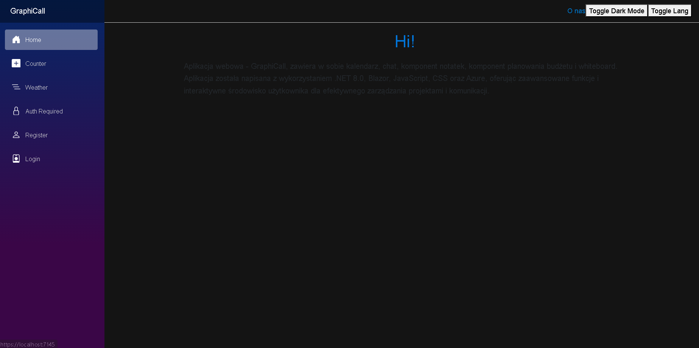

# GraphiCall



GraphiCall is a multifunctional web application that integrates various tools such as a calendar, event scheduling, note-taking, budget management, and a chat system between users. This project leverages the power of .NET 8.0, Blazor, HTML5, CSS, SignalR, EF Core, C#, the Identity libraries, and JavaScript to deliver a comprehensive user experience.

## Features

- **Calendar**: Manage your appointments and events with an easy-to-use calendar.
- **Event Scheduling**: Add and manage your personal or professional events.
- **Note-Taking**: Keep track of your tasks and ideas with the integrated note-taking feature.
- **Budget Management**: Monitor and manage your finances with built-in budgeting tools.
- **User Chat**: Communicate with other users through a real-time chat system.

## Technologies

- **.NET 8.0**
- **Blazor**
- **HTML5**
- **CSS**
- **SignalR**
- **Entity Framework Core**
- **C#**
- **Identity Framework**
- **JavaScript**

## Getting Started

### Prerequisites

- Visual Studio Community (configured for .NET development)
- SQL Server (or any compatible database)
- Node.js (for any necessary JavaScript package management)

### Setup

1. **Clone the repository**
```bash
git clone https://github.com/yourusername/GraphiCall.git
cd GraphiCall
```
2.**Configure appsettings.json**
Update the appsettings.json file with your actual configuration details:
```json
{
  "ConnectionStrings": {
    "DefaultConnection": "your_connection_string_here"
  },
  "SmtpSettings": {
    "Host": "smtp-host.com",
    "Port": 587,
    "EnableSSL": false,
    "Username": "your_email_username",
    "Password": "your_email_password",
    "FromEmail": "your_email@example.com"
  },
  "Logging": {
    "LogLevel": {
      "Default": "Information",
      "Microsoft.AspNetCore": "Warning"
    }
  },
  "AllowedHosts": "*"
}
```
3.**Run the application**
Open the project in Visual Studio Community, build the solution, and run it. Make sure your database server is configured and running.
